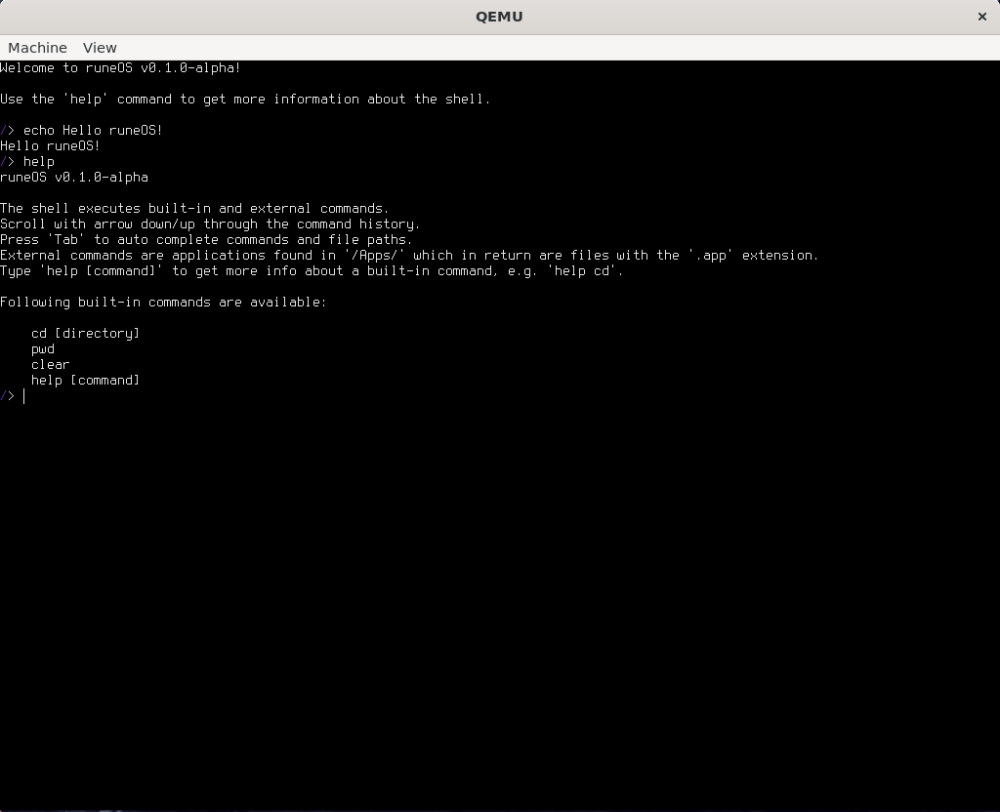

# PROJECT LOGO

An operating system for 64-bit x86 and dwarves.

---

# INSERT BADGES

## About

---

runeOS is the product of a man's journey to understand how kernels and operating systems works. Roughly speaking, the
goal is to develop a small operating system with a modern and intuitive graphical user interface that can run basic
software like a text editor, a calculator, a small game, and more.

## Features

---

- Shell with basic file manipulation commands and auto-completion
- Unix-like filesystem
- ELF loading and execution
- 64-bit monolithic kernel with
    - AHCI driver
    - FAT32 filesystem support
    - Preemptive Multithreading
    - PS2 keyboard driver
    - UEFI

## Installation

---

At the moment runeOS only runs in the Qemu VM on an Ubuntu system. First of download the latest runeOS release and unzip
it somewhere.

Next make sure that Qemu and Python are installed, run the following command:

    sudo apt install qemu-system-x86 python3

Then install the python dependencies:

    pip install -r requirements.txt

## Usage

---

To start runeOS run:

    python3 StartRuneOS.py

The first menu will be the Limine bootloader, press enter to start the OS. The shell will now be started.

At the moment, the basic filesystem manipulations commands like ls, touch, mkdir, and the usual suspects are supported.
Type 'help' to get more info about the shell features.

## Contributing

---

TODO Describe runeToolkit

1. configure
2. build cross-compiler
3. build-kernel
4. build-os
5. build-image
6. install
