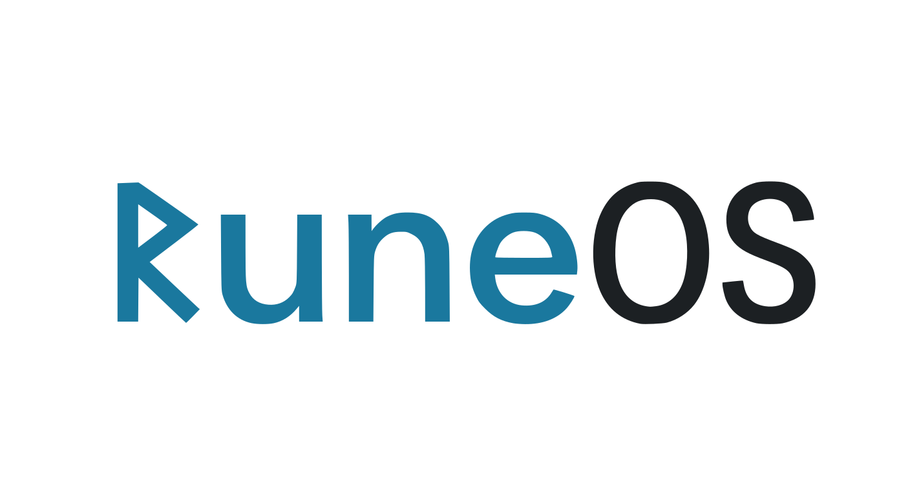
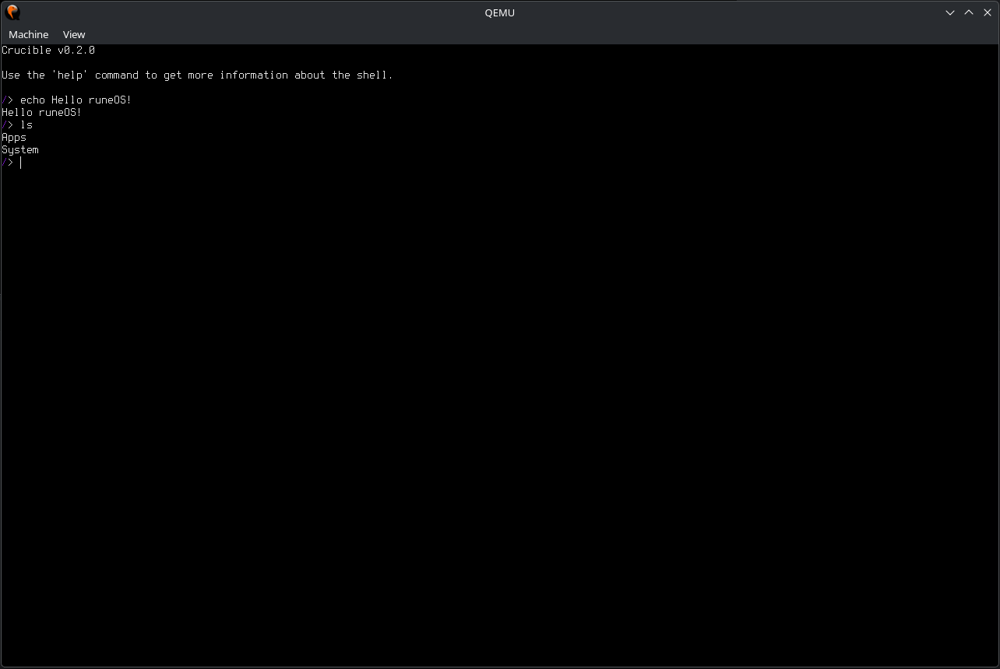

<p align="center">
  <picture>
    <source media="(prefers-color-scheme: dark)" srcset="Docs/Logo_Dark.svg">
    <source media="(prefers-color-scheme: light)" srcset="Docs/Logo_Light.svg">
    
  </picture>
</p>

<p>
    <a href="https://github.com/Ewogijk/runeOS/releases">
      
    </a>
</p>

runeOS is an operating system for the x86 architecture written in modern C++. It is intended to be a playground to
tinker around with anything related to kernel and OS development. The main goals of the project are to run on real
hardware with an easy-to-use and modern graphical user interface.

<p align="center">
  
</p>

## Features

---

- 64-bit kernel
- Preemptive multithreading
- C/C++ Standard Library support
- Unix-like filesystem (FAT32/16/12)
- ACPI
- PCI
- UEFI
- xHCI
- AHCI

## Installation

---

1. Install the system dependencies:

   ```shell
   sudo apt install qemu-system-x86 python3
   ```

2. Download the [latest release](https://github.com/Ewogijk/runeOS/releases) and unzip it somewhere.
3. Install the Python dependencies:

   ```shell 
   pip install -r requirements.txt
   ```

4. Start runeOS:

   ```shell
   ./Start.py
   ```

## 3rd Party Libraries

---

See [3RDPARTY.md](3RDPARTY.md)
